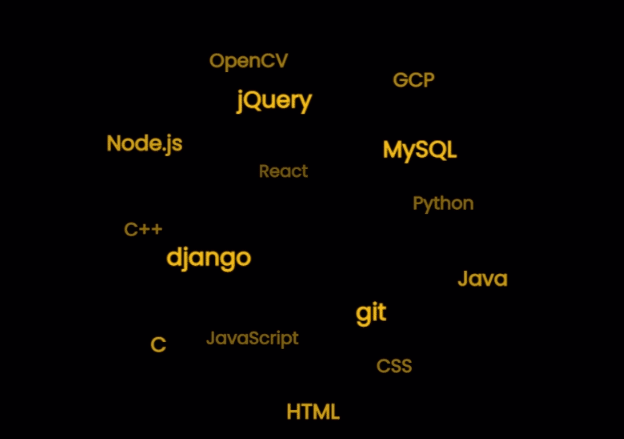

# TagCloud-reactJS

- This repo contains detail steps for implementing animated 3D text sphere in reactJS.

- I have used <b>TagCloud.js</b> npm module as react component for creating rolling word cloud.

- <b>TagCloud.js</b> is a JavaScript library that allows you to create an animated, interactive 3D sphere tag cloud from an array of text strings.
<p align="center">
  
</p>

Full documentation and usage of this module is available [here](https://github.com/cong-min/TagCloud)

## Usage

### npm

- Create a react app
```bash
$ npx create-react-app my-app
```

- Add TagCloud npm module
```bash
$ npm i -S TagCloud
```

### JavaScript

```js
const TagCloud = require('TagCloud');

const container = '.content';
const texts = [
    '3D', 'TagCloud', 'JavaScript',
    'CSS3', 'Animation', 'Interactive',
    'Mouse', 'Rolling', 'Sphere',
    '6KB', 'v2.x',
];

const options = {
  radius: 300,
  // animation speed
  // slow, normal, fast
  maxSpeed: 'fast',
  initSpeed: 'fast',
  // 0 = top
  // 90 = left
  // 135 = right-bottom
  direction: 135,
  // interact with cursor move on mouse out
  keep: true
};

TagCloud(container, texts, options);
```

### HTML
```html
<span className="content"></span>
```

### TagCloud(container, texts, options)

- Returns tagcloud instance.
- TagCloud method should be called when ever the page is reloaded which by default not the functionality of reactJS.
- For rendering this component each time page is reloaded, we need to use react hooks useEffect method.
``` js

const WordCloud = () => {
  // to render wordcloud each time the page is reloaded
  useEffect(() => {
    TagCloud(container, texts, options);
  })
  
```

The result page in browser after implementing this module can be viewed [here](https://sairamkiran9.github.io//TagCloud-reactJS/)

